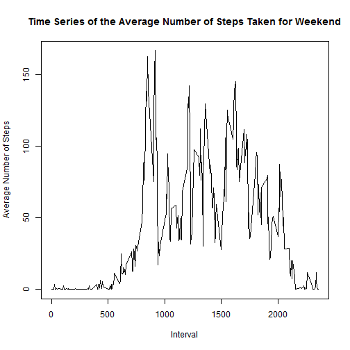

# Reproducible Research: Peer Assessment 1 #

## Loading and preprocessing the data ##


```r
activity <- read.csv("activity.csv")
completeActivity <- activity[complete.cases(activity),]
```

## What is mean total number of steps taken per day? ##
Compute total number of steps taken per day

```r
totalStepsPerDay <- aggregate(completeActivity$steps, by=list(date=completeActivity$date), FUN=sum)
```

Create the histogram for total number of steps per day

```r
hist(totalStepsPerDay$x, main="Histogram of Total Steps per Day", xlab="Total Number of Steps per Day")
```

 

Compute the mean and median of the total number of steps taken per day

```r
meanStepsPerDay <- mean(completeActivity$steps)
medianStepsPerDay <- median(completeActivity$steps)
```

The mean of the total number of steps taken per day is 37.3825996.
The median of the total number of steps taken per day is 0.

## What is the average daily activity pattern? ##
Compute the average number of steps per interval

```r
library(plyr)
```

```
## 
## Attaching package: 'plyr'
## 
## The following object is masked from 'package:lubridate':
## 
##     here
```

```r
averageStepsPerInterval <- aggregate(completeActivity$steps, by=list(interval=completeActivity$interval), FUN=mean)
```

Create the time-series plot of the 5-minute inteval and the average number of steps taken, averaged across all days

```r
plot(x ~ interval, averageStepsPerInterval, type="l", xlab="Interval", ylab="Average Number of Steps", main="Time Series of the Average Number of Steps Taken")
```

 

Find the 5-minute interval that contains the maximum number of steps on average across all the days in the dataset

```r
maxStepsPerInterval <- averageStepsPerInterval[averageStepsPerInterval$x == max(averageStepsPerInterval$x),]
```
The interval that contains the maximum number of steps is 835

## Imputing missing values ##
Calcuate the total number of missing values in the dataset

```r
totalNumberMissingValues <- nrow(activity) - nrow(completeActivity)
```
The total number of missing values in the dataset is 2304

Impute missing values by using the average for the 5-minute interval

```r
imputedCompleteActivity <- activity
for(i in 1:nrow(imputedCompleteActivity)) {
  if (is.na(imputedCompleteActivity[i,]$steps)) {
    imputedCompleteActivity[i,]$steps <- averageStepsPerInterval[averageStepsPerInterval$interval == imputedCompleteActivity[i,]$interval,]$x
  }
}
```

Compute total number of steps taken per day using dataset with missing data filled in

```r
totalStepsPerDayFilledIn <- aggregate(imputedCompleteActivity$steps, by=list(date=imputedCompleteActivity$date), FUN=sum)
```

Create the histogram for total number of steps per day

```r
hist(totalStepsPerDayFilledIn$x, main="Histogram of Total Steps per Day with Missing Values Filled In", xlab="Total Number of Steps per Day")
```

 

Compute the mean and median of the total number of steps taken per day

```r
meanStepsPerDayFilledIn <- mean(imputedCompleteActivity$steps)
medianStepsPerDayFilledIn <- median(imputedCompleteActivity$steps)
```

The mean of the total number of steps taken per day using the dataset with NA filled in is 37.3825996.
The median of the total number of steps taken per day using the dataset with NA filled in is 0.

## Are there differences in activity patterns between weekdays and weekends? ##
Create a new factor indicating whether it is in weekdays or weekend

```r
imputedCompleteActivity <- mutate(imputedCompleteActivity, weekend = ifelse(weekdays(as.Date(imputedCompleteActivity$date)) %in% c("Saturday","Sunday"),"weekend", "weekdays"))
imputedCompleteActivity <- mutate(imputedCompleteActivity, weekend = as.factor(weekend))
```

Partition the dataset into two parts: weekdays and weekend

```r
imputedCompleteActivityWeekend <- imputedCompleteActivity[imputedCompleteActivity$weekend=="weekend",]
imputedCompleteActivityWeekdays <- imputedCompleteActivity[imputedCompleteActivity$weekend=="weekdays",]
```

Compute total numbers of steps per interval for weekend and weekdays

```r
averageStepsPerIntervalWeekdays <- aggregate(imputedCompleteActivityWeekdays$steps, by=list(interval=imputedCompleteActivityWeekdays$interval), FUN=mean)
averageStepsPerIntervalWeekend <- aggregate(imputedCompleteActivityWeekend$steps, by=list(interval=imputedCompleteActivityWeekend$interval), FUN=mean)
```

Create the time-series plots of the 5-minute inteval and the average number of steps taken, averaged across all days for weekend and weekdays

```r
plot(x ~ interval, averageStepsPerIntervalWeekdays, type="l", xlab="Interval", ylab="Average Number of Steps", main="Time Series of the Average Number of Steps Taken for Weekdays")
```

 

```r
plot(x ~ interval, averageStepsPerIntervalWeekend, type="l", xlab="Interval", ylab="Average Number of Steps", main="Time Series of the Average Number of Steps Taken for Weekend")
```

 
